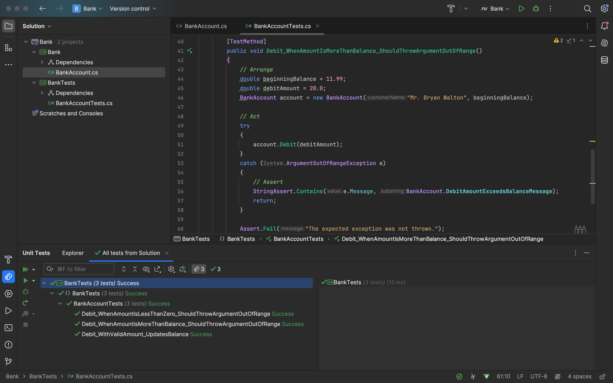
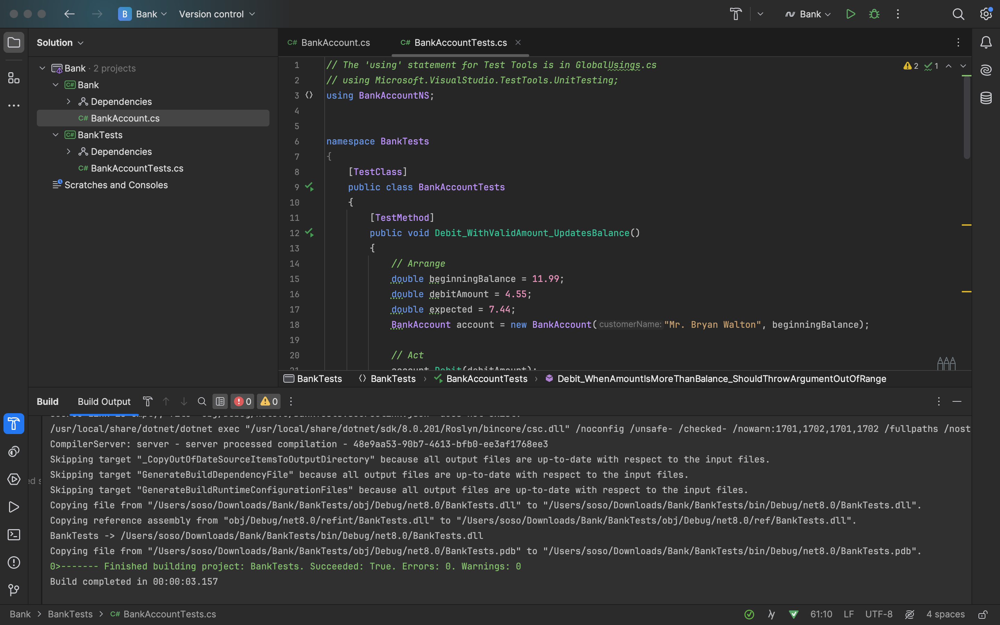

# ponderada-prog-s3-sofia

A tecnologia usada para realizar esse exercício de chama TDD, e é um princípio na qual se desenvolve o teste de uma função antes do seu escopo. Essa metodologia garante que a função já seja testada e refatorada desde o início do seu desenvolvimento. Pensando nisso, com essa ponderada eu aprendi um pouco melhor na prática a como se fazer um TDD, além de conhecer uma nova IDE chama Rider, pois o Visual Studio não é compatível com o meu sistema operacional, e foi muito legal descobrir programas novos.

Abaixo seguem os prints dos resultados obtidos na realização dos testes.

Como é possível perceber no canto inferior, todos os teste realizados passaram, o que significa que o código está funcionando como o esperado.

 

Além disso, na linha verde do console, também está a comprovação de que o código e os testes rodaram corretamente.

 
